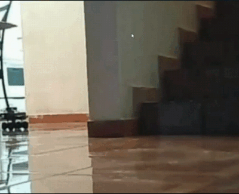
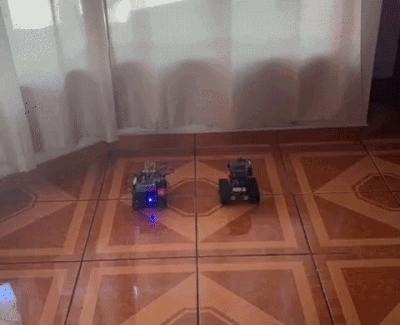
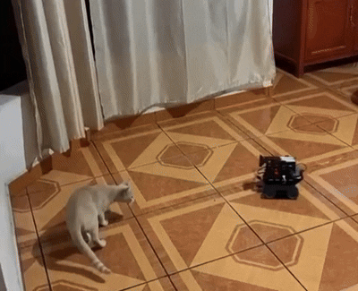

# `swarm_control_core`

Local/LAN FPV and robot control for ROS 2 fleets.

`swarm_control_core` provides low-latency first-person video, manual drive
control, and local fleet visibility on a private network. It focuses on
local/LAN operation, while `swarm_control_pro` covers the broader
remote-operations workflows used in the larger project.

   

## Quick Start

For a live local FPV/control session, use [DOCS/QUICKSTART.md](./DOCS/QUICKSTART.md).

If you are building and preparing the reference robot from scratch, start with:

1. [DOCS/setup_instructions_ASSEMBLY.md](./DOCS/setup_instructions_ASSEMBLY.md)
2. [DOCS/ADD_robot_pi.md](./DOCS/ADD_robot_pi.md)
3. [DOCS/QUICKSTART.md](./DOCS/QUICKSTART.md)

## Supported Environment

- Ubuntu 24.04
- ROS 2 Jazzy
- Private LAN or direct local Wi-Fi deployment

## Runtime Rules

- Local/LAN operation only
- `ROS_DOMAIN_ID=17`
- No required `.bashrc` exports
- Dependency install is script-driven and idempotent
- Main video uses local WebRTC; thumbnail video is bounded to protect control
  latency

## Documentation

- Quickstart: [DOCS/QUICKSTART.md](./DOCS/QUICKSTART.md)
- Add/update robots: [DOCS/ADD_robot_pi.md](./DOCS/ADD_robot_pi.md)
- Add another control machine: [DOCS/ADD_control_machine.md](./DOCS/ADD_control_machine.md)
- Control interface profiles: [DOCS/control_interface_profiles.md](./DOCS/control_interface_profiles.md)
- Assembly setup: [DOCS/setup_instructions_ASSEMBLY.md](./DOCS/setup_instructions_ASSEMBLY.md)
- GPIO wiring guides: [DOCS/GPIO/README.md](./DOCS/GPIO/README.md)
- Architecture: [DOCS/ARCHITECTURE.md](./DOCS/ARCHITECTURE.md)
- ADR index: [DOCS/ADR/README.md](./DOCS/ADR/README.md)
- Low-latency validation: [DOCS/LOW_LATENCY_VALIDATION.md](./DOCS/LOW_LATENCY_VALIDATION.md)
- Security policy: [DOCS/SECURITY.md](./DOCS/SECURITY.md)
- Code of conduct: [DOCS/CODE_OF_CONDUCT.md](./DOCS/CODE_OF_CONDUCT.md)

## Repository Layout

- `swarm_control_core/`: ROS 2 Python package and UI server
- `swarm_launch/`: robot and UI launch files
- `scripts/`: bootstrap, reset, runtime, and release-gate tooling
- `config/`: canonical robot registry plus reusable control/interface/camera defaults
- `DOCS/`: runbooks, GPIO wiring guides, architecture notes, and ADRs

## Contribution Summary

Contributions are welcome.

Accepted contributions may be credited and may receive non-monetary
career-support benefits described in this repository. Contributors are not
entitled to financial compensation, royalties, or profit-sharing unless
separately agreed in writing.

See:

- [DOCS/CONTRIBUTING.md](./DOCS/CONTRIBUTING.md)
- [DOCS/CONTRIBUTOR_BENEFITS.md](./DOCS/CONTRIBUTOR_BENEFITS.md)
- [DOCS/CONTRIBUTORS.md](./DOCS/CONTRIBUTORS.md)

## License Summary

- Free for entities below USD $1,000,000 annual gross revenue, including
  commercial use while they remain below that threshold
- Commercial license required once the licensee and its Affiliates reach or
  exceed USD $1,000,000 annual gross revenue for continued commercial use

## Contact

- Commercial licensing: `emilio@vitruvian.systems`
- Security reports: see [DOCS/SECURITY.md](./DOCS/SECURITY.md)

 
 

  

