# ROS 2 Differential Drive Robot Setup with `swarm_control_core`

After you complete the steps in this doucment you will be able to power on one (or multiple) robot(s), launch local FPV/control, and drive from your control machine on the same LAN.

### To jump STRAIGHT TO SOFTWARE INSTALLATION, <Br>skip to [Step 5](#step-5).

<br>  


## ASSUMPTIONS:

- Ubuntu 24.04 (Noble) Desktop OS
- ROS2 (Jazzy) already installed 
- You already have all of the materiels described below in the "MATERIALS" section

## Runtime Rules (Important)

- Local/LAN operation only.
- `ROS_DOMAIN_ID` is `17`.
- No `.bashrc` dependency. Do not add required runtime exports to `.bashrc`.
- Dependency install is script-driven and idempotent (installs only missing packages).
- UI streaming is local WebRTC primary with automatic MJPEG fallback.

## Deep-Dive Engineering Docs

- Architecture overview: [DOCS/ARCHITECTURE.md](./DOCS/ARCHITECTURE.md)
- Decision records (ADRs): [DOCS/ADR/README.md](./DOCS/ADR/README.md)
- Low-latency validation procedure: [DOCS/LOW_LATENCY_VALIDATION.md](./DOCS/LOW_LATENCY_VALIDATION.md)

<br>  
<br>  
<br>  

# The following assembly steps will build a Differantial Drive robot with a L298N motor controller

### For other robot types, change the assembly instuctions but keep the same software installation instructions

## MATERIALS :gear:

## ONE Raspberry Pi 4 with 4GB RAM (Model B used here)

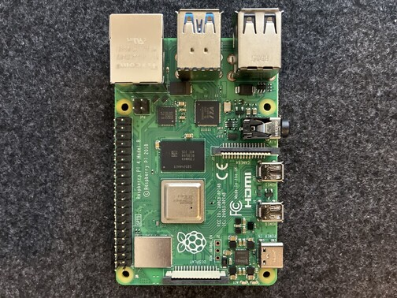 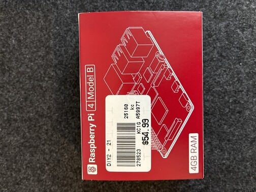

## ONE L298N Motor Controller

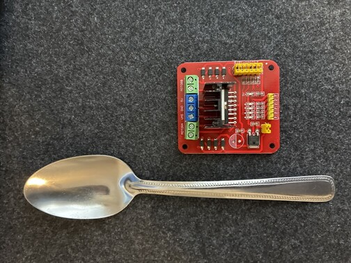 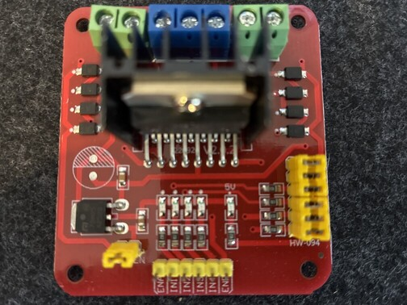

## ONE power bank / portable charger (>=10,000 mAh, QC >=18W, PD >=18W)


## ONE fuse holder with at least one 5A fuse

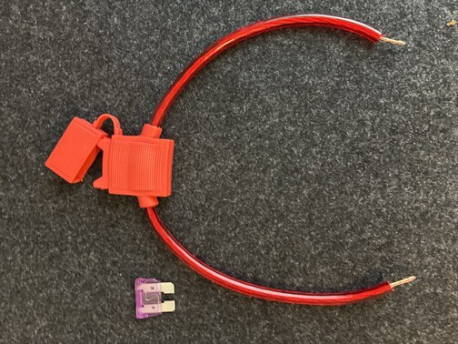 

## ONE simple ON/OFF switch

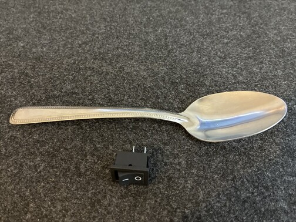

## AT LEAST TWO 3.7V 18650 Li-ion batteries (>=2200 mAh)


## AT LEAST TWO battery holders for Li-ion batteries


## ONE USB webcam


## ONE pack female-to-female jumper cables

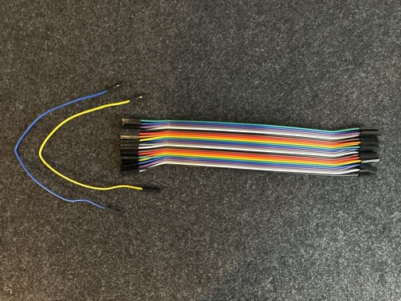

## ONE pack male-to-female jumper cables


## ONE chassis with FOUR DC gear motors

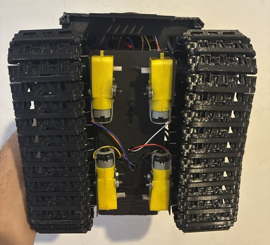

## TOOLS :toolbox:

- tweezers
- small screwdriver set
- wire stripper (or equivalent)
- hot glue gun (or equivalent adhesive)

<br>  
<br>  
<br>  

# 1. Prepare Raspberry Pi SD card

Flash Ubuntu 24.04 Noble (server) with Raspberry Pi Imager, then insert SD into the Pi.

<br>  
<br>  
<br>  

# 2. Connect Pi to motor controller

Connect Pi GND to controller GND first:

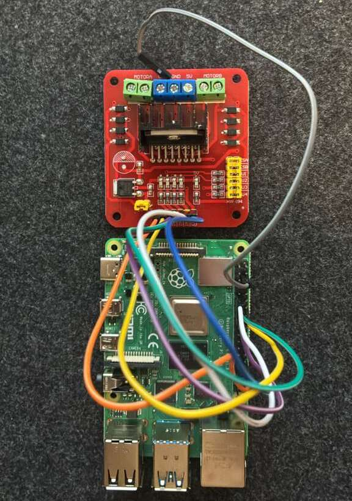

Then wire control pins:

- `ENA` -> GPIO12 (Pin 32, PWM0)
- `IN1` -> GPIO23 (Pin 16)
- `IN2` -> GPIO22 (Pin 15)
- `IN3` -> GPIO27 (Pin 13)
- `IN4` -> GPIO17 (Pin 11)
- `ENB` -> GPIO13 (Pin 33, PWM1)

Reference images:

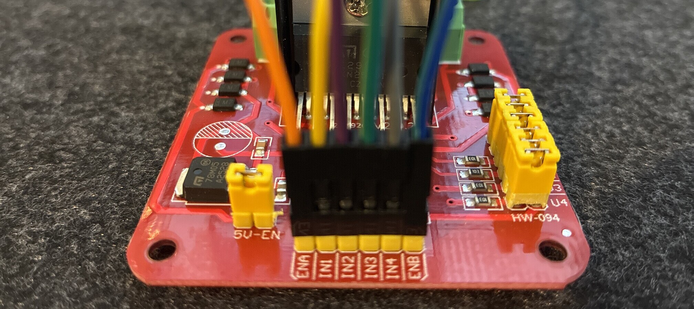
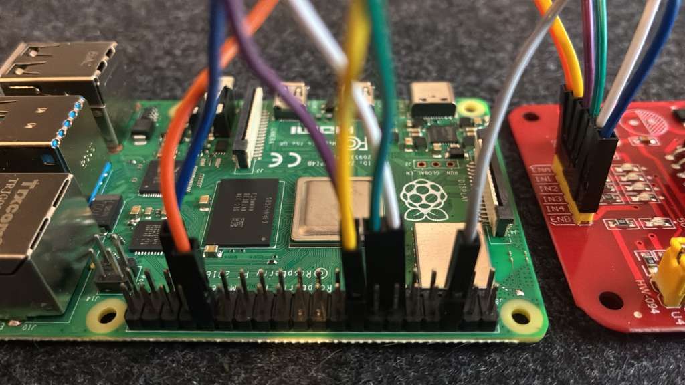
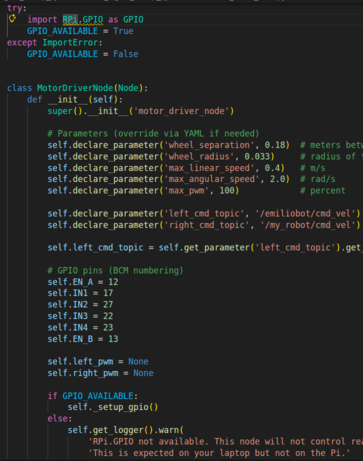 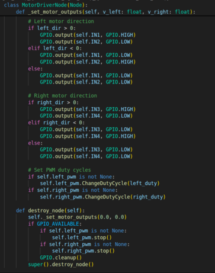

<br>  
<br>  
<br>  

# 3. Connect motors to controller

Use jumper cables to connect motor outputs on the controller to each wheel motor.

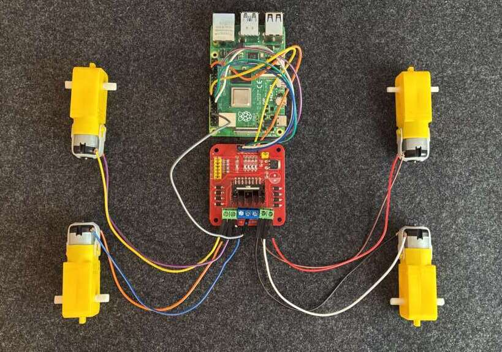

<br>  
<br>  
<br>  

# 4. Complete circuit and mechanical assembly

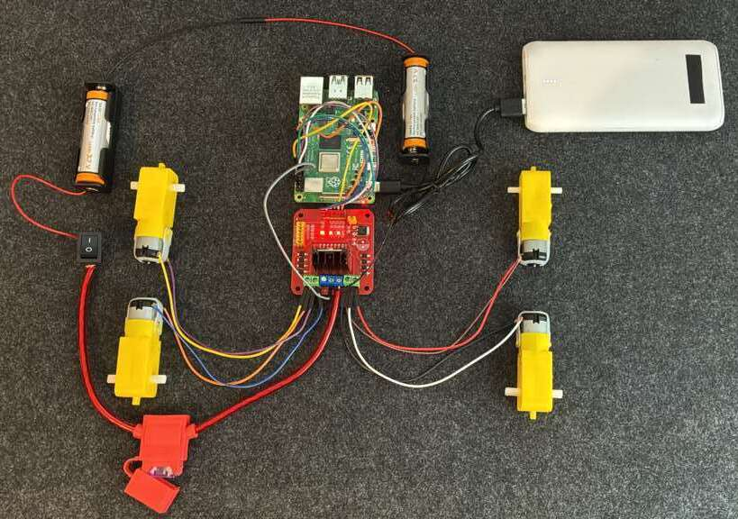
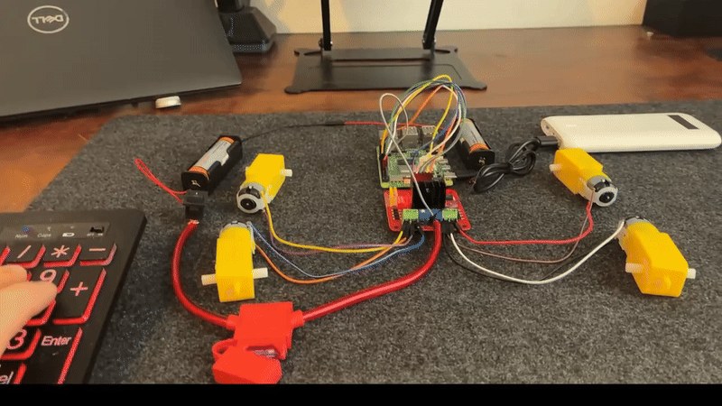

<br>  
<br>  
<br>  

<a id="step-5"></a>
# 5. Install software (community flow)

## 5.0 Reset terminals/environment to community-safe defaults

### Run on CONTROL MACHINE and on ALL ROBOTS:

```bash
mkdir -p "$HOME/ros2_ws_dev/src"
cd "$HOME/ros2_ws_dev/src"

if [ ! -d "$HOME/ros2_ws_dev/src/swarm_control_core/.git" ]; then
  git clone https://github.com/AEmilioDiStefano/swarm_control_core.git \
    "$HOME/ros2_ws_dev/src/swarm_control_core"
fi
cd "$HOME/ros2_ws_dev/src/swarm_control_core"
git fetch origin
git switch main || git checkout -b main origin/main
git pull --ff-only origin main
cd "$HOME/ros2_ws_dev/src"

source "$HOME/ros2_ws_dev/src/swarm_control_core/scripts/swarm_com_reset_env.sh" \
  --scope deep
```

This reset clears stale ROS/discovery/session state and stops existing robot/UI processes so previous runs (including other packages) do not interfere.

## 5.1 Bootstrap

### Run on CONTROL MACHINE:

```bash
"$HOME/ros2_ws_dev/src/swarm_control_core/scripts/swarm_com_bootstrap_machine.sh" \
  --machine-role control \
  --workspace "$HOME/ros2_ws_dev" \
  --domain-id 17
```

Bootstrap also seeds required runtime profile files into `~/.config/swarm_control_core/` if they are missing.

From the control machine, SSH into each robot and run the robot bootstrap block once per robot:

`ssh <robot_username>@<robot_hostname>.local`

### Run on EACH ROBOT:

```bash
cd "$HOME/ros2_ws_dev/src/swarm_control_core"
git fetch origin
git switch main || git checkout -b main origin/main
git pull --ff-only origin main

if "$HOME/ros2_ws_dev/src/swarm_control_core/scripts/swarm_com_bootstrap_machine.sh" \
  --machine-role robot \
  --workspace "$HOME/ros2_ws_dev" \
  --domain-id 17; then
  if [ -e /dev/gpiomem ] && [ -r /dev/gpiomem ] && [ -w /dev/gpiomem ]; then
    echo "[OK] Robot bootstrap complete. GPIO access is active."
  else
    echo "[INFO] Bootstrap complete, but GPIO is not active in this shell yet."
    echo "[INFO] Open a new SSH session to this robot, then continue to Step 5.2."
  fi
else
  echo "[ERROR] Bootstrap failed. Do not continue to launch steps yet."
  echo "[ERROR] Re-run this Step 5.1 block after fixing the reported dependency/setup failures."
fi
```

## 5.2 Launch robot bringup and UI

**IF** Step 5.1 reported that GPIO is not active in the current shell, SSH into that robot again from the control machine before launching:

`ssh <robot_username>@<robot_hostname>.local`

### Run on EACH ROBOT:

```bash
cd "$HOME/ros2_ws_dev"
set +u
source /opt/ros/"${ROS_DISTRO:-jazzy}"/setup.bash
colcon build --packages-select swarm_control_core
source "$HOME/ros2_ws_dev/install/setup.bash"
set -u || true

export ROS_DOMAIN_ID=17
ROBOT_NAME="${ROBOT_NAME:-$(id -un)}"
```

### Run on EACH ROBOT (save camera profile):

```bash
set +u
source /opt/ros/"${ROS_DISTRO:-jazzy}"/setup.bash
source "$HOME/ros2_ws_dev/install/setup.bash"
set -u || true

export ROS_DOMAIN_ID=17
ROBOT_NAME="${ROBOT_NAME:-$(id -un)}"
ros2 run swarm_control_core save_camera_profile_com --robot "$ROBOT_NAME"
```

### Launch robot bringup on EACH ROBOT:

```bash
export ROS_DOMAIN_ID=17
ROBOT_NAME="${ROBOT_NAME:-$(id -un)}"
"$HOME/ros2_ws_dev/src/swarm_control_core/scripts/swarm_com_run_robot.sh" "$ROBOT_NAME"
```

### Run on CONTROL MACHINE:

```bash
cd "$HOME/ros2_ws_dev"
set +u
source /opt/ros/"${ROS_DISTRO:-jazzy}"/setup.bash
colcon build --packages-select swarm_control_core
source "$HOME/ros2_ws_dev/install/setup.bash"
set -u || true

export ROS_DOMAIN_ID=17
export SWARM_COM_MAIN_STREAM_FPS="${SWARM_COM_MAIN_STREAM_FPS:-20.0}"
"$HOME/ros2_ws_dev/src/swarm_control_core/scripts/swarm_com_free_ui_port.sh" --port 8080
"$HOME/ros2_ws_dev/src/swarm_control_core/scripts/swarm_com_run_local_ui.sh"
```

Open:

- `http://127.0.0.1:8080`

## 5.3 Drive from terminal (optional)

### Run on CONTROL MACHINE 

(while robots are running launch nodes)

```bash
export ROS_DOMAIN_ID=17
set +u
source /opt/ros/"${ROS_DISTRO:-jazzy}"/setup.bash
source "$HOME/ros2_ws_dev/install/setup.bash"
set -u || true

ros2 run swarm_control_core swarm_teleop_com
```

## 5.4 Run terminal orchestrator (optional)

### Run on CONTROL MACHINE 
(while robots are running launch nodes)

```bash
export ROS_DOMAIN_ID=17
set +u
source /opt/ros/"${ROS_DISTRO:-jazzy}"/setup.bash
source "$HOME/ros2_ws_dev/install/setup.bash"
set -u || true

ros2 run swarm_control_core terminal_orchestrator_com
```

<br>  
<br>  
<br>  

# 6. Service mode and process control (optional)

Show status:

### Run on CONTROL MACHINE 
(while robots are running launch nodes)

```bash
"$HOME/ros2_ws_dev/src/swarm_control_core/scripts/swarm_com_switch_robot_mode.sh" status
```

Activate community robot service:

```bash
"$HOME/ros2_ws_dev/src/swarm_control_core/scripts/swarm_com_switch_robot_mode.sh" \
  activate --install-if-missing
```

Terminate existing robot processes before manual launch:

```bash
"$HOME/ros2_ws_dev/src/swarm_control_core/scripts/swarm_com_terminate_existing_robot_processes.sh"
```

<br>  
<br>  
<br>  

# 7. Troubleshooting quick checks

```bash
# robot-side
export ROS_DOMAIN_ID=17
set +u
source /opt/ros/"${ROS_DISTRO:-jazzy}"/setup.bash
source "$HOME/ros2_ws_dev/install/setup.bash"
set -u || true

ROBOT_NAME="${ROBOT_NAME:-$(id -un)}"
ros2 node list
ros2 topic list | rg "/${ROBOT_NAME}/(cmd_vel|heartbeat|camera)"
ros2 run swarm_control_core save_camera_profile_com --robot "$ROBOT_NAME"
```

```bash
# control-side
export ROS_DOMAIN_ID=17
set +u
source /opt/ros/"${ROS_DISTRO:-jazzy}"/setup.bash
source "$HOME/ros2_ws_dev/install/setup.bash"
set -u || true

ros2 topic list | rg "/.*/(heartbeat|camera/image_raw|cmd_vel)"
```

For DRP-style startup and extended fix paths, use:

- [`DOCS/QUICKSTART.md`](DOCS/QUICKSTART.md)
- [`DOCS/LOCAL_FPV_runbook.md`](DOCS/LOCAL_FPV_runbook.md)

## License

Apache-2.0
